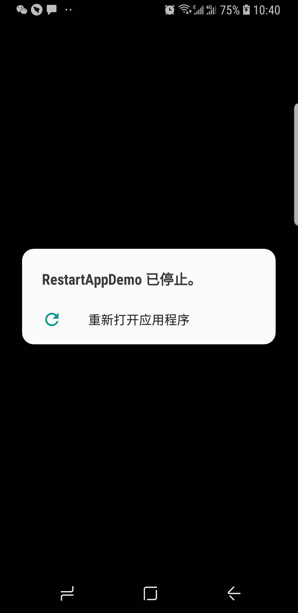

# RestartAppDemo
Tag：App崩溃恢复、App回收恢复

##目的

* 演示App在后台被系统回收后, 点击App Launcher Icon的启动流程，Activity的恢复原则
* 演示App崩溃后，系统自动重启（Android系统的行为），Activity的恢复原则

## 项目结构
SplashActivity 启动页面

MainActivity 主页面

InformationActivity 信息显示页面

在MyApplication定义一个Static型变量：`public static List<String> mDatas;`， 在SplashActivity中初始化，在InformationActivity中使用。

##操作流程

**Step1、第一次启动App流程**

MyApplication -> SplashActivity -> MainActivity -> InformationActivity

日志如下：

```
com.didichuxing.restartapp.demo E/MyApplication: onCreate
com.didichuxing.restartapp.demo E/SplashActivity: onCreate
com.didichuxing.restartapp.demo E/MainActivity: onCreate
com.didichuxing.restartapp.demo E/InformationActivity: onCreate
```

**Step2、点击Home键App进入后台，再点击Android Studio logcat里的 终止应用模拟app被系统回收，此时点击App Launcher Icon启动App**

> 此时在 华为Pad上和小米4上的日志如下：

```
#By DDF  MyApplication -> InformationActivity -> Crash 
09-29 11:38:48.898 13275 13275 E MyApplication: onCreate
09-29 11:38:48.941 13275 13275 E InformationActivity: onCreate
09-29 11:38:49.020 13275 13275 E AndroidRuntime: Process: com.didichuxing.restartapp.demo, PID: 13275
09-29 11:38:49.020 13275 13275 E AndroidRuntime: java.lang.RuntimeException: Unable to start activity ComponentInfo{com.didichuxing.restartapp.demo/com.didichuxing.restartapp.demo.InformationActivity}: java.lang.NullPointerException: Attempt to invoke interface method 'java.lang.Object java.util.List.get(int)' on a null object reference
09-29 11:38:49.020 13275 13275 E AndroidRuntime: 	at com.didichuxing.restartapp.demo.InformationActivity.onCreate(InformationActivity.java:17)
09-29 11:38:49.022  1739  3851 W ActivityManager:   Force finishing activity com.didichuxing.restartapp.demo/.InformationActivity
09-29 11:38:49.045  1739  3653 I ActivityManager: Process com.didichuxing.restartapp.demo (pid 13275) has died

# By DDF Crash后系统自动重启 -> MyApplication -> MainActivity
09-29 11:38:49.064  1739  3653 I ActivityManager: Start proc 13295:com.didichuxing.restartapp.demo/u0a158 for activity com.didichuxing.restartapp.demo/.MainActivity
09-29 11:38:49.165 13295 13295 E MyApplication: onCreate
09-29 11:38:49.282 13295 13295 E MainActivity: onCreate
```


MyApplication -> InformationActivity -> Crash、系统自动重启 -> MyApplication -> MainActivity


> 在三星手机上表现如下：

MyApplication -> InformationActivity -> Crash、后系统弹窗点击重启 -> MyApplication -> MainActivity




##结论

### 一、 App在后台被系统回收后, 点击App Launcher Icon的启动流程，Activity的恢复原则

**进程回收之后，再从历史程序里点击的时候，进程会重启，然后只恢复栈顶的activity，其他栈内的activity只有在需要的时候被恢复。**

经常听到有人说android内存不足时会回收activity，这是不对的，android内存不足时会去查后台进程，杀死某些进程来获取内存。杀activity的说法是不对的。Android在运行程序的过程中发现内存不足，他会去杀一些后台进程，来获取内存。如果后台进程都杀光了，内存还不够，此时可能有2种表现，1，跳出OOM崩溃 2，杀死前台进程  并没有回收某个activity或者回收某些activity的行为

具体参见（很好的一篇文章）：[android进程重启及activity恢复](https://blog.csdn.net/litefish/article/details/51685232)

### 二、App崩溃后，系统自动重启（Android系统的行为），Activity的恢复原则

Crash后系统的行为	

经测试，Android在API21以下（也就是Android5.0以下），crash后会直接退出应用；但是在API21以上（5.0以上系统），会遵循以下原则重启： 

1. 包含service, 如果程序crash的时候，运行着service，那么系统会重新启动service 。 
2. 不包含service，只有一个Activity，那么系统不会重新启动该Activity 。 
3. 不包含service，但是当前栈中包含两个Activity, A–>B, 如果B crash，那么系统会重启A。 
4. 不包含service，但是当前栈中包含三个Activity, A–>B–>C, 如果C crash，那么系统会重启B，并且A仍然存在，即可以从重启的Back到A。

一句话：

**前台进程死亡后恢复，恢复的是当前显示的activity的上一个activity，记住activity要想被恢复，必须是经历过onSaveInstanceState的activity。**


1. Activity崩溃后, Android系统会重建ActivityTask, 从Task中移除异常崩溃的那个Activity, Task中倒数第二个Activity展示出来, 执行onCreate. Task中其他的Activity不会执行onCreate

2. ActivityTask恢复也会恢复所有的ActivityTask, 以及前后台关系.

3. 单例, 静态变量等的初始化, 不要放到你的StartActivity中,这样不靠谱. 建议懒加载, 如果非要使用,  可以放到App中.  或者直接注册崩溃Handler, 自己把进程kill掉.用户重新启动App(这也不是很靠谱)


###三、崩溃后App是否自动重启
Android在API21以下（也就是Android5.0以下），crash后会直接退出应用；但是在API21以上（5.0以上系统）根据rom不同有不同表现：在三星手机会提示 XXX已经停止, 然后可以选择重启App点击重启后 (在小米、华为Pad手机上直接重启)


## Ref

[Android Activity崩溃恢复研究](https://my.oschina.net/sfshine/blog/1635489)